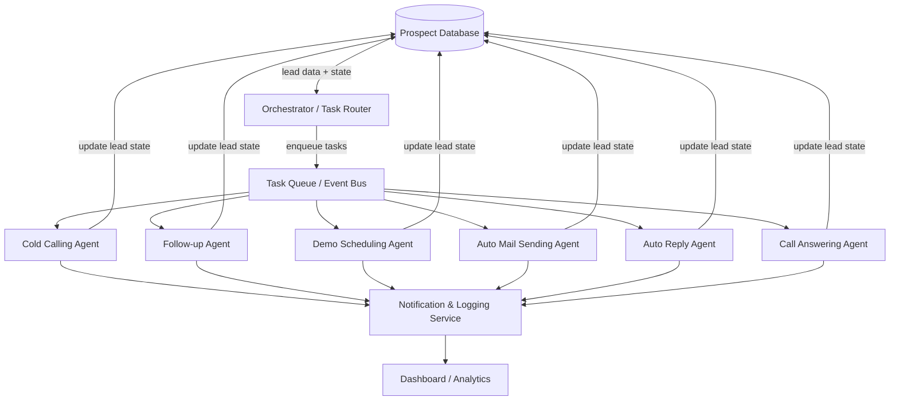
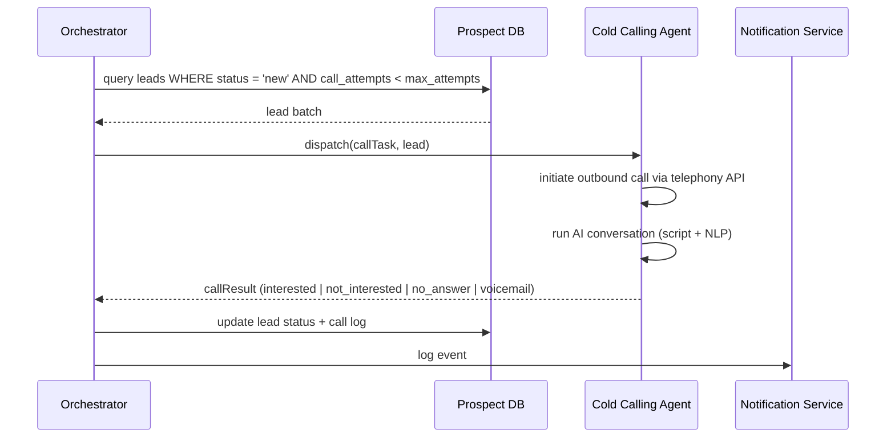
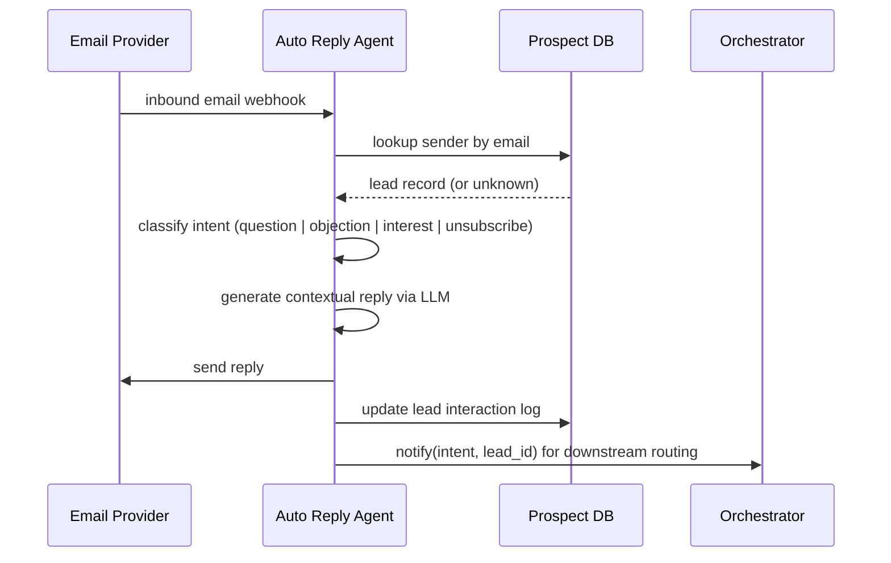
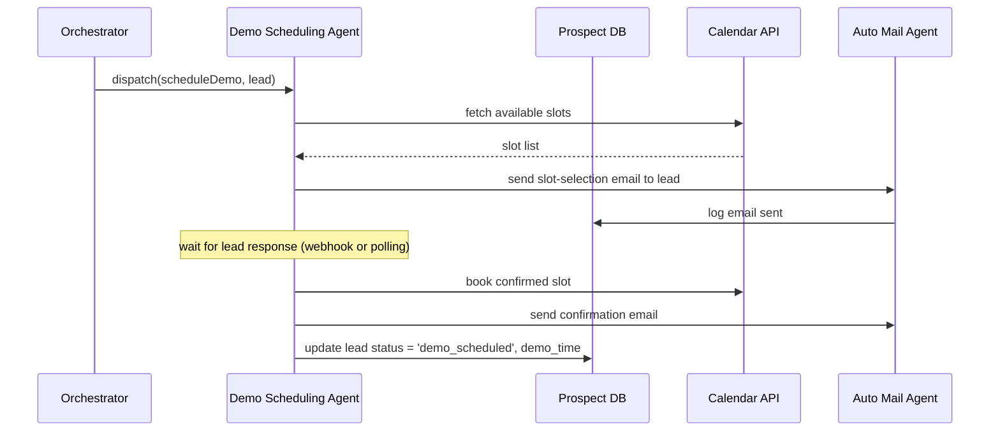

# Design Document: AI Sales Automation System

## Overview

The AI Sales Automation System is a unified, multi-agent platform that automates the full outbound and inbound sales lifecycle — from cold outreach and follow-ups to demo scheduling, email automation, and live call handling. All agents share a central prospect database, coordinate through an orchestration layer, and update lead state in real time so every touchpoint is context-aware and non-duplicative.

The system is designed around six specialized agents that operate autonomously but are governed by a central Orchestrator. The Orchestrator reads lead state from the shared database, decides which agent should act next, dispatches tasks, and writes outcomes back — ensuring no lead is contacted twice by the wrong channel at the wrong time.

The architecture prioritizes reliability (every action is logged and retryable), extensibility (new agents can be added without touching existing ones), and observability (a dashboard surfaces pipeline health, agent activity, and conversion metrics in real time).

---

## Architecture



---

## Sequence Diagrams

### Outbound Cold Call Flow



### Inbound Email Auto-Reply Flow



### Demo Scheduling Flow



---

## Components and Interfaces

### Orchestrator

**Purpose**: Central brain — reads lead state, applies routing rules, dispatches tasks to agents, and processes outcomes.

**Interface**:
```pascal
INTERFACE Orchestrator
  PROCEDURE run()
  PROCEDURE evaluateLead(lead: Lead): AgentTask
  PROCEDURE dispatch(task: AgentTask)
  PROCEDURE handleOutcome(outcome: TaskOutcome)
END INTERFACE
```

**Responsibilities**:
- Poll or subscribe to DB changes to detect leads needing action
- Apply priority rules and cooldown windows to prevent over-contacting
- Route leads to the correct agent based on current status and history
- Persist all task outcomes back to the database

---

### Cold Calling Agent

**Purpose**: Initiates outbound AI-driven phone calls to new or re-engaged leads.

**Interface**:
```pascal
INTERFACE ColdCallingAgent
  PROCEDURE call(lead: Lead): CallResult
  PROCEDURE handleVoicemail(lead: Lead)
  PROCEDURE transcribeCall(callId: String): Transcript
END INTERFACE
```

**Responsibilities**:
- Integrate with telephony provider (e.g., Twilio, Bland AI)
- Run AI conversation using a configurable call script
- Detect call outcome: answered, voicemail, no-answer, busy
- Transcribe and summarize call; extract intent signals
- Respect do-not-call lists and calling hour windows

---

### Follow-up Agent

**Purpose**: Re-engages leads that did not respond to initial outreach after a configurable delay.

**Interface**:
```pascal
INTERFACE FollowUpAgent
  PROCEDURE scheduleFollowUp(lead: Lead, delayHours: Integer)
  PROCEDURE executeFollowUp(lead: Lead): FollowUpResult
  PROCEDURE selectChannel(lead: Lead): Channel
END INTERFACE
```

**Responsibilities**:
- Determine optimal follow-up channel (call, email, SMS) based on lead history
- Respect maximum follow-up attempt limits
- Personalize follow-up content using prior interaction context
- Escalate to human rep if lead remains unresponsive after N attempts

---

### Demo Scheduling Agent

**Purpose**: Coordinates calendar availability and books product demos with interested leads.

**Interface**:
```pascal
INTERFACE DemoSchedulingAgent
  PROCEDURE proposeSlots(lead: Lead): SlotList
  PROCEDURE confirmBooking(lead: Lead, slot: TimeSlot): Booking
  PROCEDURE sendReminder(booking: Booking)
  PROCEDURE handleReschedule(booking: Booking, newSlot: TimeSlot)
END INTERFACE
```

**Responsibilities**:
- Integrate with calendar APIs (Google Calendar, Outlook, Calendly)
- Offer available slots via email or chat
- Confirm, reschedule, or cancel bookings
- Send automated reminders 24h and 1h before demo

---

### Auto Mail Sending Agent

**Purpose**: Sends templated and AI-personalized outbound emails at scheduled times.

**Interface**:
```pascal
INTERFACE AutoMailAgent
  PROCEDURE sendEmail(lead: Lead, template: EmailTemplate): EmailResult
  PROCEDURE personalizeContent(lead: Lead, template: EmailTemplate): String
  PROCEDURE scheduleEmail(lead: Lead, template: EmailTemplate, sendAt: DateTime)
  PROCEDURE trackOpen(emailId: String): Boolean
END INTERFACE
```

**Responsibilities**:
- Integrate with email provider (SendGrid, AWS SES, Mailgun)
- Personalize subject and body using lead data and LLM
- Track open, click, and reply events via webhooks
- Manage unsubscribe requests and suppression lists

---

### Auto Reply Agent

**Purpose**: Monitors inbound emails and messages, classifies intent, and sends contextual AI-generated replies.

**Interface**:
```pascal
INTERFACE AutoReplyAgent
  PROCEDURE receiveMessage(message: InboundMessage): void
  PROCEDURE classifyIntent(message: InboundMessage): Intent
  PROCEDURE generateReply(lead: Lead, intent: Intent): String
  PROCEDURE sendReply(message: InboundMessage, reply: String): void
END INTERFACE
```

**Responsibilities**:
- Listen for inbound email/message webhooks
- Match sender to existing lead record or create new one
- Classify intent: question, objection, interest, meeting request, unsubscribe
- Generate and send contextual reply via LLM
- Escalate to human if confidence is below threshold

---

### Call Answering Agent

**Purpose**: Handles inbound calls, qualifies callers, answers FAQs, and routes to humans when needed.

**Interface**:
```pascal
INTERFACE CallAnsweringAgent
  PROCEDURE answerCall(callId: String, caller: CallerInfo): void
  PROCEDURE qualifyCaller(callId: String): QualificationResult
  PROCEDURE routeToHuman(callId: String, reason: String): void
  PROCEDURE logCall(callId: String, summary: CallSummary): void
END INTERFACE
```

**Responsibilities**:
- Answer inbound calls via telephony webhook
- Run AI-driven qualification conversation
- Answer common product/pricing questions from knowledge base
- Transfer to human rep when caller requests it or intent is unclear
- Log full transcript and qualification outcome

---

## Data Models

### Lead

```pascal
STRUCTURE Lead
  id: UUID
  first_name: String
  last_name: String
  email: String
  phone: String
  company: String
  status: LeadStatus
  source: String
  assigned_agent: AgentType | NULL
  call_attempts: Integer
  email_attempts: Integer
  last_contacted_at: DateTime | NULL
  next_action_at: DateTime | NULL
  demo_scheduled_at: DateTime | NULL
  tags: List<String>
  notes: String
  created_at: DateTime
  updated_at: DateTime
END STRUCTURE

ENUM LeadStatus
  new
  contacted
  interested
  follow_up_scheduled
  demo_scheduled
  demo_completed
  converted
  not_interested
  unsubscribed
  do_not_contact
END ENUM
```

### Interaction Log

```pascal
STRUCTURE InteractionLog
  id: UUID
  lead_id: UUID
  agent_type: AgentType
  channel: Channel
  direction: inbound | outbound
  timestamp: DateTime
  duration_seconds: Integer | NULL
  summary: String
  intent_detected: Intent | NULL
  outcome: String
  raw_transcript: String | NULL
END STRUCTURE
```

### Agent Task

```pascal
STRUCTURE AgentTask
  id: UUID
  lead_id: UUID
  agent_type: AgentType
  action: String
  payload: Map<String, Any>
  priority: Integer
  scheduled_at: DateTime
  status: queued | in_progress | completed | failed | retrying
  retry_count: Integer
  created_at: DateTime
END STRUCTURE
```

### Email Template

```pascal
STRUCTURE EmailTemplate
  id: UUID
  name: String
  subject_template: String
  body_template: String
  agent_type: AgentType
  stage: LeadStatus
  variables: List<String>
END STRUCTURE
```

### Booking

```pascal
STRUCTURE Booking
  id: UUID
  lead_id: UUID
  calendar_event_id: String
  scheduled_at: DateTime
  duration_minutes: Integer
  status: pending | confirmed | cancelled | rescheduled | completed
  reminder_sent: Boolean
  meeting_link: String | NULL
END STRUCTURE
```

---

## Algorithmic Pseudocode

### Orchestrator Main Loop

```pascal
PROCEDURE run()
  LOOP
    leads ← database.queryLeadsPendingAction(now())
    
    FOR each lead IN leads DO
      IF isOnCooldown(lead) THEN
        CONTINUE
      END IF
      
      task ← evaluateLead(lead)
      
      IF task IS NOT NULL THEN
        dispatch(task)
        database.updateLeadNextActionAt(lead.id, task.scheduled_at)
      END IF
    END FOR
    
    WAIT config.orchestratorPollIntervalSeconds
  END LOOP
END PROCEDURE
```

### Lead Routing Algorithm

```pascal
PROCEDURE evaluateLead(lead: Lead): AgentTask
  INPUT: lead of type Lead
  OUTPUT: task of type AgentTask or NULL

  SEQUENCE
    IF lead.status = 'do_not_contact' OR lead.status = 'unsubscribed' THEN
      RETURN NULL
    END IF

    IF lead.status = 'new' AND lead.call_attempts < config.maxColdCallAttempts THEN
      RETURN buildTask(lead, COLD_CALLING_AGENT, 'call')
    END IF

    IF lead.status = 'new' AND lead.call_attempts >= config.maxColdCallAttempts THEN
      RETURN buildTask(lead, AUTO_MAIL_AGENT, 'send_intro_email')
    END IF

    IF lead.status = 'contacted' AND hoursSince(lead.last_contacted_at) >= config.followUpDelayHours THEN
      RETURN buildTask(lead, FOLLOW_UP_AGENT, 'follow_up')
    END IF

    IF lead.status = 'interested' THEN
      RETURN buildTask(lead, DEMO_SCHEDULING_AGENT, 'schedule_demo')
    END IF

    IF lead.status = 'demo_scheduled' AND hoursUntil(lead.demo_scheduled_at) <= 24 THEN
      RETURN buildTask(lead, DEMO_SCHEDULING_AGENT, 'send_reminder')
    END IF

    RETURN NULL
  END SEQUENCE
END PROCEDURE
```

### Cold Calling Agent — Call Execution

```pascal
PROCEDURE call(lead: Lead): CallResult
  INPUT: lead of type Lead
  OUTPUT: result of type CallResult

  SEQUENCE
    IF NOT isWithinCallingHours(lead.phone) THEN
      RETURN CallResult(outcome: 'deferred', reason: 'outside_calling_hours')
    END IF

    IF isOnDoNotCallList(lead.phone) THEN
      database.updateLeadStatus(lead.id, 'do_not_contact')
      RETURN CallResult(outcome: 'blocked', reason: 'dnc_list')
    END IF

    callSession ← telephonyAPI.initiateCall(lead.phone)

    IF callSession.status = 'no_answer' OR callSession.status = 'busy' THEN
      database.incrementCallAttempts(lead.id)
      RETURN CallResult(outcome: 'no_answer')
    END IF

    IF callSession.status = 'voicemail' THEN
      handleVoicemail(lead)
      RETURN CallResult(outcome: 'voicemail')
    END IF

    // Call answered — run AI conversation
    script ← loadScript('cold_call', lead)
    conversation ← aiConversationEngine.run(callSession, script, lead)
    transcript ← transcribeCall(callSession.id)
    intent ← nlpEngine.extractIntent(transcript)

    database.logInteraction(lead.id, COLD_CALLING_AGENT, 'outbound_call', transcript, intent)
    database.incrementCallAttempts(lead.id)

    IF intent = 'interested' THEN
      database.updateLeadStatus(lead.id, 'interested')
    ELSE IF intent = 'not_interested' THEN
      database.updateLeadStatus(lead.id, 'not_interested')
    ELSE
      database.updateLeadStatus(lead.id, 'contacted')
    END IF

    RETURN CallResult(outcome: intent, transcript: transcript)
  END SEQUENCE
END PROCEDURE
```

### Auto Reply Agent — Inbound Message Handling

```pascal
PROCEDURE receiveMessage(message: InboundMessage): void
  INPUT: message of type InboundMessage

  SEQUENCE
    lead ← database.findLeadByEmail(message.senderEmail)

    IF lead IS NULL THEN
      lead ← database.createLeadFromInbound(message)
    END IF

    intent ← classifyIntent(message)

    IF intent = 'unsubscribe' THEN
      database.updateLeadStatus(lead.id, 'unsubscribed')
      sendReply(message, loadTemplate('unsubscribe_confirmation'))
      RETURN
    END IF

    confidence ← nlpEngine.getConfidenceScore(intent)

    IF confidence < config.autoReplyConfidenceThreshold THEN
      escalateToHuman(lead, message, 'low_confidence')
      RETURN
    END IF

    reply ← generateReply(lead, intent)
    sendReply(message, reply)
    database.logInteraction(lead.id, AUTO_REPLY_AGENT, 'inbound_email', message.body, intent)

    // Notify orchestrator for downstream routing
    orchestrator.handleOutcome(TaskOutcome(lead_id: lead.id, intent: intent, channel: 'email'))
  END SEQUENCE
END PROCEDURE
```

### Demo Scheduling Agent — Slot Proposal and Booking

```pascal
PROCEDURE proposeSlots(lead: Lead): SlotList
  INPUT: lead of type Lead
  OUTPUT: slots of type SlotList

  SEQUENCE
    availableSlots ← calendarAPI.getAvailableSlots(
      from: now(),
      to: now() + config.schedulingWindowDays,
      duration: config.demoDurationMinutes
    )

    IF availableSlots IS EMPTY THEN
      notifyAdmin('no_slots_available')
      RETURN EmptySlotList
    END IF

    // Offer top N slots to lead
    topSlots ← availableSlots.take(config.maxSlotsToOffer)
    emailBody ← autoMailAgent.personalizeContent(lead, loadTemplate('demo_slot_proposal', topSlots))
    autoMailAgent.sendEmail(lead, emailBody)
    database.updateLeadStatus(lead.id, 'follow_up_scheduled')

    RETURN topSlots
  END SEQUENCE
END PROCEDURE

PROCEDURE confirmBooking(lead: Lead, slot: TimeSlot): Booking
  INPUT: lead of type Lead, slot of type TimeSlot
  OUTPUT: booking of type Booking

  SEQUENCE
    calendarEvent ← calendarAPI.createEvent(slot, lead, config.demoDurationMinutes)
    
    booking ← Booking(
      lead_id: lead.id,
      calendar_event_id: calendarEvent.id,
      scheduled_at: slot.start,
      duration_minutes: config.demoDurationMinutes,
      status: 'confirmed',
      meeting_link: calendarEvent.meetingLink
    )
    
    database.saveBooking(booking)
    database.updateLeadStatus(lead.id, 'demo_scheduled')
    database.updateLeadDemoScheduledAt(lead.id, slot.start)

    autoMailAgent.sendEmail(lead, loadTemplate('demo_confirmation', booking))

    RETURN booking
  END SEQUENCE
END PROCEDURE
```

### Follow-up Agent — Channel Selection and Execution

```pascal
PROCEDURE executeFollowUp(lead: Lead): FollowUpResult
  INPUT: lead of type Lead
  OUTPUT: result of type FollowUpResult

  SEQUENCE
    IF lead.email_attempts + lead.call_attempts >= config.maxTotalFollowUpAttempts THEN
      database.updateLeadStatus(lead.id, 'not_interested')
      escalateToHuman(lead, 'max_attempts_reached')
      RETURN FollowUpResult(outcome: 'escalated')
    END IF

    channel ← selectChannel(lead)

    IF channel = 'call' THEN
      result ← coldCallingAgent.call(lead)
    ELSE IF channel = 'email' THEN
      template ← selectFollowUpEmailTemplate(lead)
      result ← autoMailAgent.sendEmail(lead, template)
    ELSE IF channel = 'sms' THEN
      result ← smsProvider.send(lead.phone, personalizeMessage(lead, 'sms_follow_up'))
    END IF

    database.logInteraction(lead.id, FOLLOW_UP_AGENT, channel, result.summary, result.intent)

    RETURN FollowUpResult(outcome: result.outcome, channel: channel)
  END SEQUENCE
END PROCEDURE

PROCEDURE selectChannel(lead: Lead): Channel
  INPUT: lead of type Lead
  OUTPUT: channel of type Channel

  SEQUENCE
    // Alternate channels to avoid fatigue
    lastInteraction ← database.getLastInteraction(lead.id)

    IF lastInteraction IS NULL THEN
      RETURN 'call'
    END IF

    IF lastInteraction.channel = 'call' THEN
      RETURN 'email'
    END IF

    IF lastInteraction.channel = 'email' THEN
      IF lead.phone IS NOT NULL THEN
        RETURN 'call'
      ELSE
        RETURN 'email'
      END IF
    END IF

    RETURN 'email'
  END SEQUENCE
END PROCEDURE
```

---

## Key Functions with Formal Specifications

### isOnCooldown(lead)

```pascal
FUNCTION isOnCooldown(lead: Lead): Boolean
```

**Preconditions:**
- `lead` is non-null with a valid `last_contacted_at` field (may be NULL for new leads)

**Postconditions:**
- Returns `true` if `now() - lead.last_contacted_at < config.cooldownMinutes`
- Returns `false` if `lead.last_contacted_at` is NULL (never contacted)
- No mutations to lead record

**Loop Invariants:** N/A

---

### nlpEngine.extractIntent(transcript)

```pascal
FUNCTION extractIntent(transcript: String): Intent
```

**Preconditions:**
- `transcript` is a non-empty string
- NLP model is loaded and available

**Postconditions:**
- Returns one of: `interested`, `not_interested`, `question`, `objection`, `callback_requested`, `unknown`
- Confidence score is attached to result
- No side effects

**Loop Invariants:** N/A

---

### autoMailAgent.personalizeContent(lead, template)

```pascal
FUNCTION personalizeContent(lead: Lead, template: EmailTemplate): String
```

**Preconditions:**
- `lead` has non-null `first_name`, `email`, `company`
- `template.body_template` contains valid variable placeholders
- LLM service is reachable

**Postconditions:**
- All template variables are replaced with lead-specific values
- Output length does not exceed email provider limits
- Returns a non-empty string

---

## Error Handling

### Telephony API Failure

**Condition**: Telephony provider returns error or times out during call initiation
**Response**: Log error, mark task as `failed`, increment retry counter
**Recovery**: Retry up to `config.maxTaskRetries` times with exponential backoff; after max retries, escalate to human queue

### LLM Service Unavailable

**Condition**: AI conversation engine or NLP service is unreachable
**Response**: Pause agent execution, log alert to notification service
**Recovery**: Queue tasks for retry when service recovers; fall back to static script templates if configured

### Calendar API Conflict

**Condition**: Slot becomes unavailable between proposal and booking confirmation
**Response**: Notify lead of conflict, re-propose alternative slots
**Recovery**: Re-fetch available slots and send updated proposal email automatically

### Inbound Message — Unknown Sender

**Condition**: Inbound email sender does not match any lead in the database
**Response**: Create a new lead record with `source = 'inbound_email'`, proceed with auto-reply
**Recovery**: Flag for human review if message contains high-value signals (e.g., pricing questions)

### Max Retry Exceeded

**Condition**: Any agent task fails after `config.maxTaskRetries` attempts
**Response**: Mark task as `permanently_failed`, update lead status to `requires_human_review`
**Recovery**: Surface in dashboard; notify assigned sales rep via notification service

---

## Testing Strategy

### Unit Testing Approach

Each agent is tested in isolation with mocked external dependencies (telephony API, calendar API, email provider, LLM service). Key test cases:

- Orchestrator routing logic covers all `LeadStatus` transitions
- `isOnCooldown` returns correct result for edge cases (NULL timestamp, exact boundary)
- `selectChannel` alternates correctly across interaction history
- `evaluateLead` returns NULL for `do_not_contact` and `unsubscribed` leads

### Property-Based Testing Approach

**Property Test Library**: fast-check (JavaScript/TypeScript) or Hypothesis (Python)

Key properties to verify:

- For any lead with `status = 'do_not_contact'`, `evaluateLead` always returns NULL
- For any sequence of agent outcomes, lead status transitions are monotonically forward (no regression to earlier states without explicit reset)
- `personalizeContent` with any valid lead and template always produces a non-empty string with no unresolved placeholders
- `selectChannel` never returns a channel that requires a field the lead does not have (e.g., SMS without a phone number)

### Integration Testing Approach

End-to-end flows tested against a staging database and sandboxed external APIs:

- Full outbound flow: new lead → cold call → follow-up email → demo scheduling → confirmation email
- Inbound flow: email received → auto-reply → orchestrator routing → demo scheduling
- Failure recovery: telephony timeout → retry → escalation

---

## Performance Considerations

- The Orchestrator poll interval should be tunable (`config.orchestratorPollIntervalSeconds`); for high-volume deployments, replace polling with a CDC (Change Data Capture) event stream from the database.
- Agent tasks are processed via a distributed task queue (e.g., BullMQ, Celery, SQS) to allow horizontal scaling of individual agents independently.
- LLM calls are the primary latency bottleneck; responses should be streamed where possible and cached for repeated FAQ patterns in the Call Answering Agent.
- Email sending is fire-and-forget with async delivery confirmation via webhooks; never block the Orchestrator loop on email delivery.
- Calendar slot fetching should be cached with a short TTL (e.g., 60 seconds) to reduce API calls during high-volume scheduling periods.

---

## Security Considerations

- All lead PII (phone, email, name) is encrypted at rest in the database and in transit via TLS.
- Telephony and email provider API keys are stored in a secrets manager (e.g., AWS Secrets Manager, HashiCorp Vault) — never in environment variables or source code.
- Inbound webhook endpoints are authenticated via HMAC signature verification to prevent spoofed events.
- Do-not-call and unsubscribe lists are checked before every outbound action; violations are logged as security events.
- LLM prompts include system-level guardrails to prevent prompt injection via inbound lead messages.
- All agent actions are append-only logged to an audit trail that cannot be modified post-write.

---

## Dependencies

| Dependency | Purpose | Examples |
|---|---|---|
| Telephony Provider | Outbound/inbound calls | Twilio, Bland AI, Vapi |
| Email Provider | Outbound email delivery | SendGrid, AWS SES, Mailgun |
| Calendar API | Slot availability + booking | Google Calendar API, Microsoft Graph, Calendly |
| LLM Service | Conversation, NLP, personalization | OpenAI GPT-4o, Anthropic Claude, local Ollama |
| Task Queue | Async agent task dispatch | BullMQ, Celery, AWS SQS |
| Database | Prospect data + interaction logs | PostgreSQL, MySQL, MongoDB |
| Notification Service | Alerts, escalations, dashboard events | Slack webhooks, PagerDuty, custom |
| Secrets Manager | API key storage | AWS Secrets Manager, HashiCorp Vault |

---

## UI/UX Design

The product UI is designed as a premium, dark-mode-first SaaS dashboard — dense with data but never cluttered. The aesthetic draws from products like Linear, Vercel, and Retool: sharp typography, subtle depth, purposeful motion, and a layout that surfaces the right information at the right time. Every screen is built around the operator's mental model: "What is happening right now, and what needs my attention?"

---

### Design System

#### Color Palette

**Dark Theme (Primary)**

| Token | Hex | Usage |
|---|---|---|
| `--bg-base` | `#0A0A0F` | App background |
| `--bg-surface` | `#111118` | Cards, panels |
| `--bg-elevated` | `#1A1A24` | Modals, dropdowns, hover states |
| `--bg-subtle` | `#22222E` | Table rows, input backgrounds |
| `--border` | `#2A2A38` | Dividers, card borders |
| `--border-strong` | `#3A3A50` | Active borders, focus rings |
| `--text-primary` | `#F0F0FF` | Headings, primary labels |
| `--text-secondary` | `#8888AA` | Subtext, metadata, timestamps |
| `--text-muted` | `#55556A` | Placeholders, disabled states |
| `--accent-blue` | `#4F8EF7` | Primary actions, links, active nav |
| `--accent-blue-dim` | `#1A3A6A` | Blue badge backgrounds |
| `--accent-green` | `#34D399` | Success, active agents, converted |
| `--accent-green-dim` | `#0D3D2A` | Green badge backgrounds |
| `--accent-amber` | `#FBBF24` | Warnings, follow-up needed |
| `--accent-amber-dim` | `#3D2E0A` | Amber badge backgrounds |
| `--accent-red` | `#F87171` | Errors, failed tasks, escalations |
| `--accent-red-dim` | `#3D1010` | Red badge backgrounds |
| `--accent-purple` | `#A78BFA` | AI-generated content indicators |

**Light Theme (Secondary)**

Inverted surface hierarchy with `#FAFAFA` base, `#FFFFFF` cards, `#F0F0F5` subtle backgrounds. All accent colors remain identical for brand consistency. Light theme is opt-in via user settings.

---

#### Typography

| Role | Font | Weight | Size | Line Height |
|---|---|---|---|---|
| Display | Inter | 700 | 28px | 1.2 |
| Heading 1 | Inter | 600 | 20px | 1.3 |
| Heading 2 | Inter | 600 | 16px | 1.4 |
| Body | Inter | 400 | 14px | 1.6 |
| Body Small | Inter | 400 | 13px | 1.5 |
| Label | Inter | 500 | 12px | 1.4 |
| Mono / Code | JetBrains Mono | 400 | 13px | 1.6 |
| Numeric KPI | Inter | 700 | 32–48px | 1.0 |

Font loading: Inter via `next/font` (zero layout shift). JetBrains Mono for transcript viewers, task IDs, and log output.

---

#### Spacing & Grid

- Base unit: `4px`
- Component padding: `12px / 16px / 24px`
- Card gap: `12px`
- Section gap: `32px`
- Sidebar width: `220px` (collapsed: `56px`)
- Content max-width: `1440px`
- Grid: 12-column fluid with `24px` gutters

---

#### Component Library

**Foundation**: Tailwind CSS v4 for utility-first styling.
**Component Primitives**: shadcn/ui (Radix UI under the hood) for accessible, unstyled primitives — dialogs, dropdowns, tooltips, popovers, command palette.
**Charts**: Recharts (lightweight, composable) for all analytics visualizations.
**Tables**: TanStack Table v8 for virtualized, sortable, filterable data tables.
**Calendar**: react-big-calendar for the demo scheduling view.
**Animations**: Framer Motion for page transitions, card entrances, and micro-interactions. CSS transitions for hover/focus states.
**Icons**: Lucide React (consistent stroke weight, tree-shakeable).

---

#### Micro-interaction Principles

- Button press: `scale(0.97)` + `100ms` ease-out
- Card hover: `translateY(-1px)` + border brightens to `--border-strong`
- Status badge pulse: 2s infinite CSS animation for `active` agent states
- Number counters: animate from previous value to new value over `600ms` on data refresh
- Skeleton loaders: shimmer animation (`--bg-subtle` → `--bg-elevated` → `--bg-subtle`)
- Toast notifications: slide in from bottom-right, auto-dismiss at 4s, stack up to 3

---

### Navigation & Layout

#### Global Shell

```
┌─────────────────────────────────────────────────────────────────┐
│  SIDEBAR (220px)          │  TOPBAR (48px)                      │
│  ─────────────────────    │  ─────────────────────────────────  │
│  Logo + Workspace Name    │  Page Title   [Search] [Notif] [Me] │
│                           ├─────────────────────────────────────┤
│  ● Dashboard              │                                     │
│  ● Leads                  │                                     │
│  ● Agents                 │         MAIN CONTENT AREA           │
│  ● Interactions           │                                     │
│  ● Demos                  │                                     │
│  ● Analytics              │                                     │
│  ─────────────────────    │                                     │
│  ● Notifications      [3] │                                     │
│  ─────────────────────    │                                     │
│  Settings                 │                                     │
│  [Avatar] John D.         │                                     │
└───────────────────────────┴─────────────────────────────────────┘
```

**Sidebar behavior**:
- Pinned by default on ≥1280px screens
- Collapsible to icon-only mode (56px) via toggle; state persisted in `localStorage`
- Active nav item: left border accent (`--accent-blue`), background `--bg-elevated`
- Notification badge on "Notifications" nav item shows unread count (red dot if >0)
- Bottom section: Settings link + user avatar with name and role label

**Topbar**:
- Height: 48px, `border-bottom: 1px solid --border`
- Global search (`⌘K`) opens a full command palette (shadcn/ui Command) — searches leads, agents, interactions, docs
- Notification bell opens a slide-over panel (not a page navigation)
- User avatar opens a dropdown: Profile, Theme toggle, Sign out

**Responsive breakpoints**:
- `< 768px`: Sidebar hidden, accessible via hamburger → full-screen drawer
- `768–1279px`: Sidebar collapsed to icon-only by default
- `≥ 1280px`: Sidebar pinned and expanded

---

### Dashboard / Home Screen

**Route**: `/dashboard`

The dashboard is the operator's mission control — a single-glance view of pipeline health, agent status, and what needs attention right now.

#### Layout

```
┌──────────────────────────────────────────────────────────────────┐
│  KPI ROW (4 cards)                                               │
│  [Calls Made]  [Emails Sent]  [Demos Scheduled]  [Conv. Rate]   │
├──────────────────────────────────────────────────────────────────┤
│  AGENT STATUS GRID (6 cards, 3-col)   │  ACTIVITY FEED          │
│  [Cold Calling]  [Follow-up]          │  ─────────────────────  │
│  [Demo Sched.]   [Auto Mail]          │  Live event stream      │
│  [Auto Reply]    [Call Answering]     │  (last 50 events)       │
├───────────────────────────────────────┤                         │
│  PIPELINE FUNNEL (horizontal bar)     │                         │
│  New → Contacted → Interested →       │                         │
│  Demo Sched. → Converted              │                         │
└───────────────────────────────────────┴─────────────────────────┘
```

#### KPI Metric Cards

Each card: `--bg-surface` background, `1px` border, `16px` padding, `8px` border-radius.

```
┌─────────────────────────┐
│  CALLS MADE TODAY       │
│                         │
│  247          ↑ 12%     │
│  ─────────────────────  │
│  vs. 220 yesterday      │
└─────────────────────────┘
```

- Large numeric value (32px, weight 700)
- Trend indicator: green arrow + percentage if positive, red if negative
- Subtext: comparison period
- Sparkline (7-day mini chart) in bottom-right corner using Recharts `<AreaChart>`
- Cards: Calls Made, Emails Sent, Demos Scheduled, Conversion Rate

#### Agent Status Cards

One card per agent (6 total), arranged in a 3-column grid.

```
┌──────────────────────────────┐
│  ● COLD CALLING AGENT        │
│  Status: ACTIVE              │
│                              │
│  Tasks in queue:  14         │
│  Completed today: 89         │
│  Last action: 2m ago         │
│                              │
│  [Pause]  [View Queue]       │
└──────────────────────────────┘
```

- Status indicator dot: green pulse animation for `active`, amber static for `paused`, red for `error`
- Status label: `ACTIVE` / `PAUSED` / `ERROR` in matching color
- Three key metrics: queue depth, today's completions, last action timestamp
- Two inline action buttons: Pause/Resume toggle + "View Queue" link
- Error state: card border turns `--accent-red`, shows error message snippet

#### Pipeline Funnel

Horizontal segmented bar showing lead counts at each stage. Each segment is proportionally sized and color-coded:

- New: `--text-muted` (gray)
- Contacted: `--accent-blue`
- Interested: `--accent-purple`
- Demo Scheduled: `--accent-amber`
- Converted: `--accent-green`

Hovering a segment shows a tooltip with exact count and percentage of total.

#### Real-Time Activity Feed

Right-side panel, full height. Scrollable list of the last 50 system events, newest at top.

```
  2m ago  ● Cold Calling Agent
          Called Sarah Chen (Acme Corp)
          Outcome: Interested → Demo scheduled

  5m ago  ● Auto Mail Agent
          Sent follow-up email to 12 leads
          Template: "Day 3 Follow-up"

  8m ago  ⚠ Auto Reply Agent
          Low confidence reply — escalated
          Lead: Marcus Webb
```

- Each event: timestamp, agent icon + name, one-line description, outcome badge
- Color-coded left border by agent type
- Warning events (⚠) use `--accent-amber` border
- Error events use `--accent-red` border
- "Load more" button at bottom; auto-refreshes via WebSocket subscription

---

### Lead Management View

**Route**: `/leads`

The central CRM-style view for all prospects in the system.

#### Layout

```
┌──────────────────────────────────────────────────────────────────┐
│  [Search leads...]  [Status ▾]  [Source ▾]  [Agent ▾]  [+ Add] │
│  [Table View] [Kanban View]          Selected: 0  [Bulk Actions] │
├──────────────────────────────────────────────────────────────────┤
│  TABLE / KANBAN CONTENT                                          │
└──────────────────────────────────────────────────────────────────┘
```

#### Table View (Default)

Built on TanStack Table v8 with virtualization for large datasets.

| Column | Width | Notes |
|---|---|---|
| ☐ (checkbox) | 40px | Multi-select for bulk actions |
| Name | 180px | Avatar initials + full name, clickable → lead detail |
| Company | 140px | Company name |
| Status | 120px | Colored badge (LeadStatus enum) |
| Last Contacted | 120px | Relative time ("2h ago") |
| Next Action | 120px | Scheduled action + time |
| Assigned Agent | 140px | Agent type badge |
| Call Attempts | 80px | Numeric |
| Email Attempts | 80px | Numeric |
| Actions | 80px | ⋯ menu: View, Edit, Reassign, Mark DNC |

- Row hover: background `--bg-elevated`
- Clicking a row opens the Lead Detail slide-over (not a page navigation)
- Column headers are sortable (click to sort asc/desc, click again to clear)
- Sticky header on scroll

**Filters**:
- Status: multi-select dropdown (all LeadStatus values)
- Source: multi-select
- Assigned Agent: multi-select
- Date range: "Last contacted" date picker
- All filters are URL-synced (shareable filtered views)

**Search**: Full-text search across name, email, company. Debounced 300ms. Results highlight matched text.

**Bulk Actions** (visible when ≥1 row selected):
- Reassign to agent
- Change status
- Export to CSV
- Mark as Do Not Contact
- Delete (with confirmation dialog)

#### Kanban View

Columns = LeadStatus values. Each card shows: name, company, last contacted, next action badge.

- Drag-and-drop between columns updates lead status via optimistic UI + API call
- Column headers show count badge
- Cards are paginated within columns (load more at bottom)
- Compact card design: 200px wide, 80px tall

---

### Agent Control Panel

**Route**: `/agents`

Detailed operational view for monitoring and controlling each agent.

#### Layout

```
┌──────────────────────────────────────────────────────────────────┐
│  AGENT SELECTOR TABS                                             │
│  [Cold Calling] [Follow-up] [Demo Sched.] [Auto Mail] [+2 more] │
├──────────────────────────────────────────────────────────────────┤
│  AGENT HEADER                                                    │
│  Cold Calling Agent  ● ACTIVE  [Pause Agent]  [View Config]     │
├──────────────────────────────────────────────────────────────────┤
│  STATS ROW                                                       │
│  [Queue: 14]  [Running: 2]  [Done Today: 89]  [Failed: 1]       │
├──────────────────────────────────────────────────────────────────┤
│  LIVE TASK QUEUE                    │  RECENT COMPLETIONS        │
│  ─────────────────────────────────  │  ─────────────────────    │
│  Priority-sorted task list          │  Last 20 completed tasks  │
└─────────────────────────────────────┴───────────────────────────┘
```

#### Agent Header

- Agent name + status dot (animated pulse for active)
- Pause/Resume toggle button: changes label and dot color, sends API call, shows loading spinner during transition
- "View Config" opens a slide-over with editable agent configuration (max attempts, cooldown windows, calling hours, etc.)

#### Stats Row

Four metric chips in a horizontal row:
- Queue depth (tasks waiting)
- Currently running tasks
- Completed today
- Failed today (red if > 0)

#### Live Task Queue

Scrollable list of queued tasks, sorted by priority descending.

```
  #1  [HIGH]  Call Sarah Chen (Acme Corp)
              Scheduled: now  ·  Attempt 1 of 3
              [Cancel]

  #2  [MED]   Call Marcus Webb (TechFlow)
              Scheduled: in 4m  ·  Attempt 2 of 3
              [Cancel]
```

- Priority badge: red for HIGH, amber for MED, gray for LOW
- Each task shows: lead name + company, scheduled time, attempt count
- Cancel button removes task from queue (with confirmation)
- Tasks currently `in_progress` show a spinner and "Running..." label

#### Recent Completions

Right panel, last 20 completed tasks with outcome badges:
- `success` → green badge
- `voicemail` → amber badge
- `no_answer` → gray badge
- `failed` → red badge

Clicking a completion row opens the full interaction log for that task.

---

### Interaction Timeline

**Route**: `/leads/:id` (or slide-over from Lead Management)

Per-lead view showing the complete history of every touchpoint.

#### Layout

```
┌──────────────────────────────────────────────────────────────────┐
│  LEAD HEADER                                                     │
│  [Avatar] Sarah Chen · Acme Corp · sarah@acme.com · +1-555-...  │
│  Status: [Demo Scheduled ▾]  Next: Demo in 2 days               │
├──────────────────────────────────────────────────────────────────┤
│  LEAD DETAILS (left 30%)    │  INTERACTION TIMELINE (right 70%) │
│  ─────────────────────────  │  ─────────────────────────────    │
│  Contact info               │  Chronological event list         │
│  Tags                       │  with expandable details          │
│  Notes (editable)           │                                   │
│  Assigned agent             │                                   │
└─────────────────────────────┴───────────────────────────────────┘
```

#### Lead Details Panel

- Editable fields: status (dropdown), tags (multi-select chip input), notes (textarea, auto-save on blur)
- Read-only: source, created date, call/email attempt counts
- "Reassign Agent" button opens a dropdown of available agents

#### Interaction Timeline

Vertical timeline, newest event at top. Each event is a card:

**Call Event Card**:
```
  ┌─────────────────────────────────────────────────────┐
  │  📞 Outbound Call  ·  Cold Calling Agent             │
  │  Mar 15, 2025 · 10:23 AM  ·  Duration: 4m 12s       │
  │  Outcome: [Interested]                               │
  │                                                      │
  │  Summary: Lead expressed interest in the Enterprise  │
  │  plan. Asked about API integrations. Agreed to demo. │
  │                                                      │
  │  [▶ Play Recording]  [View Full Transcript ▾]        │
  └─────────────────────────────────────────────────────┘
```

**Email Event Card**:
```
  ┌─────────────────────────────────────────────────────┐
  │  ✉ Outbound Email  ·  Auto Mail Agent               │
  │  Mar 14, 2025 · 9:00 AM                             │
  │  Subject: "Quick question about Acme's sales stack" │
  │  Status: [Opened] [Clicked]                         │
  │                                                      │
  │  [Preview Email ▾]                                   │
  └─────────────────────────────────────────────────────┘
```

**Demo Event Card**:
```
  ┌─────────────────────────────────────────────────────┐
  │  📅 Demo Scheduled  ·  Demo Scheduling Agent        │
  │  Mar 17, 2025 · 2:00 PM (30 min)                   │
  │  Status: [Confirmed]                                │
  │  Meeting: [Join Link]                               │
  └─────────────────────────────────────────────────────┘
```

**Transcript Viewer** (expandable within call card):
- Monospace font (JetBrains Mono), 13px
- Speaker-labeled turns: `[Agent]` and `[Lead]` with timestamps
- AI-detected intent highlighted inline (e.g., "interested" phrase underlined in green)
- Copy-to-clipboard button

---

### Demo Scheduling View

**Route**: `/demos`

Calendar-centric view for managing all upcoming and past demos.

#### Layout

```
┌──────────────────────────────────────────────────────────────────┐
│  [← Mar 2025 →]  [Day] [Week] [Month]    [+ Manual Book]        │
├──────────────────────────────────────────────────────────────────┤
│  CALENDAR (react-big-calendar)          │  UPCOMING DEMOS LIST   │
│                                         │  ─────────────────────│
│  Week view default.                     │  Today (3)            │
│  Demo events shown as colored blocks.   │  Tomorrow (5)         │
│  Hover → tooltip with lead name.        │  This week (12)       │
│  Click → opens booking detail panel.   │                        │
└─────────────────────────────────────────┴────────────────────────┘
```

#### Calendar

- Week view by default; toggle to Day or Month
- Each demo block: lead name + company, color-coded by status (`confirmed` = blue, `pending` = amber, `cancelled` = red strikethrough)
- Clicking a block opens a slide-over with full booking details
- Empty slots are clickable to trigger manual booking flow

#### Booking Detail Slide-over

```
  Demo with Sarah Chen (Acme Corp)
  ─────────────────────────────────
  Date: Mar 17, 2025 · 2:00–2:30 PM
  Status: Confirmed
  Meeting Link: [zoom.us/j/...] [Copy]

  Lead Status: Demo Scheduled
  Assigned Rep: —

  [Send Reminder]  [Reschedule]  [Cancel]
```

- "Send Reminder" triggers an immediate reminder email (with confirmation toast)
- "Reschedule" opens a slot picker (fetches live calendar availability)
- "Cancel" shows a confirmation dialog with optional cancellation message to lead

#### Upcoming Demos List (Right Panel)

Grouped by day. Each item: lead name, company, time, status badge, quick-action buttons (Remind, Cancel).

---

### Analytics & Reporting

**Route**: `/analytics`

Data visualization hub for pipeline performance and agent effectiveness.

#### Layout

```
┌──────────────────────────────────────────────────────────────────┐
│  Date Range: [Last 7 days ▾]  [Export CSV]  [Export PDF]        │
├──────────────────────────────────────────────────────────────────┤
│  ROW 1: Conversion Funnel (full width)                           │
├──────────────────────────────────────────────────────────────────┤
│  ROW 2: [Agent Performance]  │  [Email Metrics]                  │
├──────────────────────────────┼───────────────────────────────────┤
│  ROW 3: [Call Outcomes]      │  [Lead Source Breakdown]          │
└──────────────────────────────┴───────────────────────────────────┘
```

#### Conversion Funnel Chart

Full-width horizontal funnel chart (Recharts `<FunnelChart>`):

```
  New Leads     Contacted     Interested    Demo Sched.   Converted
  ──────────    ──────────    ──────────    ──────────    ──────────
  1,240         847 (68%)     312 (37%)     198 (63%)     89 (45%)
  ████████████  ████████      █████         ████          ██
```

- Each stage shows absolute count + conversion rate from previous stage
- Hover tooltip: count, rate, avg time in stage
- Click a stage → filters Lead Management view to that status

#### Agent Performance Table + Chart

Split view: bar chart (tasks completed per agent per day) + summary table.

Table columns: Agent Name, Tasks Today, Tasks This Week, Success Rate, Avg Response Time, Escalations.

Bar chart: grouped bars by agent, x-axis = days, y-axis = task count.

#### Email Metrics

Line chart showing over time:
- Open rate (%)
- Click rate (%)
- Reply rate (%)

Plus summary cards: Total Sent, Avg Open Rate, Avg Click Rate, Unsubscribes.

#### Call Outcomes Donut Chart

Recharts `<PieChart>` showing distribution of call outcomes:
- Interested (green)
- Not Interested (red)
- Voicemail (amber)
- No Answer (gray)
- Callback Requested (blue)

Center label shows total calls in selected period.

#### Lead Source Breakdown

Horizontal bar chart: leads by source (cold list, inbound email, referral, etc.) with conversion rate overlay as a line.

---

### Notification Center

**Route**: Slide-over panel (triggered from topbar bell icon, not a page)

#### Layout

```
  NOTIFICATIONS                    [Mark all read]  [Settings]
  ─────────────────────────────────────────────────────────────
  TABS: [All]  [Escalations]  [System]  [Reminders]

  ● UNREAD
  ─────────────────────────────────────────────────────────────
  ⚠ Escalation · 5m ago
    Auto Reply Agent: Low confidence on inbound from Marcus Webb
    [Review Now]

  ⚠ Escalation · 12m ago
    Follow-up Agent: Max attempts reached for 3 leads
    [View Leads]

  ─────────────────────────────────────────────────────────────
  READ
  ─────────────────────────────────────────────────────────────
  ✓ System · 1h ago
    Cold Calling Agent resumed after telephony outage
```

#### Notification Types

| Type | Icon | Color | Description |
|---|---|---|---|
| Escalation | ⚠ | `--accent-amber` | Requires human review |
| Error | ✕ | `--accent-red` | Agent failure, API error |
| Success | ✓ | `--accent-green` | Milestone reached (e.g., 100 demos booked) |
| Reminder | 🔔 | `--accent-blue` | Scheduled reminders |
| System | ⚙ | `--text-secondary` | Agent status changes, config updates |

#### Human Review Queue

Accessible via "Escalations" tab. Table view of all leads/interactions flagged for human review:

| Column | Notes |
|---|---|
| Lead | Name + company |
| Reason | "Low confidence reply", "Max attempts", "Pricing question" |
| Agent | Which agent escalated |
| Time | When escalated |
| Actions | [Review] [Dismiss] [Reassign] |

"Review" opens the Interaction Timeline for that lead in a modal.

#### Notification Settings (slide-over within slide-over)

Toggles per notification type: In-app, Email digest (daily/weekly), Slack webhook.

---

### UX Principles & States

#### Loading States

- **Page-level**: Full-page skeleton layout matching the page structure (not a spinner). Skeleton uses shimmer animation.
- **Component-level**: Individual card/table skeletons while data loads. Never show empty state before data has had a chance to load.
- **Action-level**: Inline spinner on buttons during async operations. Button disabled + shows spinner, label changes to "Saving..." or "Pausing...".
- **Optimistic UI**: Status changes (lead status, agent pause/resume) update instantly in the UI; roll back with error toast if API call fails.

#### Empty States

Each empty state has: an icon, a headline, a one-line description, and a primary CTA.

```
  [Icon: inbox with arrow]
  No leads yet
  Import a CSV or connect your CRM to get started.
  [Import Leads]  [Connect CRM]
```

Empty states per view:
- Leads table: "No leads match your filters" → [Clear Filters]
- Activity feed: "No activity yet" → [View Agents]
- Notifications: "You're all caught up" → no CTA needed
- Demo calendar: "No demos scheduled" → [View Interested Leads]
- Task queue: "Queue is empty" → [View Agent Config]

#### Error States

- **Inline field errors**: Red border + error message below field, `--accent-red` text, 12px
- **Component errors**: Error card replaces the component with icon + message + retry button
- **Page-level errors**: Full-page error with status code, message, and "Go back" / "Retry" buttons
- **Toast errors**: Slide in from bottom-right, red background, auto-dismiss at 6s (longer than success toasts)
- **API errors**: Always show user-friendly message ("Something went wrong. Try again.") — never expose raw error codes in the UI

#### Real-Time Updates via WebSocket

The dashboard, activity feed, agent status cards, and notification center all subscribe to a WebSocket connection on mount.

**Event types pushed from server**:
- `agent.status_changed` → updates agent card status dot + label
- `task.completed` → increments agent completion counter, appends to activity feed
- `task.failed` → increments failed counter, triggers notification badge
- `lead.status_changed` → updates lead row in table (if visible) without full re-fetch
- `notification.new` → increments bell badge, prepends to notification panel
- `kpi.updated` → animates KPI card numbers to new values

**Connection management**:
- Reconnect with exponential backoff (1s, 2s, 4s, 8s, max 30s)
- Show a subtle "Reconnecting..." banner at the top of the page when disconnected
- Banner auto-dismisses when connection is restored
- All real-time updates are also reflected in the next full data fetch (no stale state)

#### Keyboard Navigation & Accessibility

- All interactive elements reachable via `Tab` key
- `⌘K` / `Ctrl+K`: opens global command palette
- `Escape`: closes any open modal, slide-over, or dropdown
- `J` / `K`: navigate up/down in lists (leads table, task queue) when list is focused
- All status badges and icons have `aria-label` attributes
- Color is never the sole indicator of state (always paired with text or icon)
- Focus rings: `2px solid --accent-blue` with `2px offset`, visible in both themes


---

## Correctness Properties

*A property is a characteristic or behavior that should hold true across all valid executions of a system — essentially, a formal statement about what the system should do. Properties serve as the bridge between human-readable specifications and machine-verifiable correctness guarantees.*

### Property 1: DNC and Unsubscribed Leads Never Dispatched

For any lead whose status is `do_not_contact` or `unsubscribed`, the Orchestrator's `evaluateLead` function SHALL always return NULL and no outbound task SHALL be dispatched.

**Validates: Requirements 1.6, 8.3**

---

### Property 2: Cooldown Window Correctness

For any lead with a non-null `last_contacted_at` timestamp, `isOnCooldown` SHALL return `true` if and only if the elapsed time since `last_contacted_at` is strictly less than `config.cooldownMinutes`. For any lead with a null `last_contacted_at`, `isOnCooldown` SHALL always return `false`.

**Validates: Requirements 1.7, 1.8**

---

### Property 3: Lead Routing Determinism

For any lead in a given status with a given attempt count and contact history, `evaluateLead` SHALL always return the same agent task type — the routing function is pure and deterministic given the same inputs.

**Validates: Requirements 1.1, 1.2, 1.3, 1.4, 1.5**

---

### Property 4: Lead Status Monotonic Progression

For any sequence of agent task outcomes applied to a lead, the lead's status SHALL only transition forward through the defined LeadStatus pipeline. No agent action SHALL cause a lead to regress to an earlier status without an explicit operator reset.

**Validates: Requirements 8.1**

---

### Property 5: Email Personalization Completeness

For any valid Lead record and any EmailTemplate with well-formed variable placeholders, `personalizeContent` SHALL produce a non-empty string that contains no unresolved template variable placeholders.

**Validates: Requirements 5.1, 5.2**

---

### Property 6: Channel Selection Safety

For any lead interaction history, `selectChannel` SHALL never return `sms` for a lead whose `phone` field is null. The selected channel SHALL always be one that the lead's available contact fields support.

**Validates: Requirements 3.2, 3.3, 3.4, 3.5**

---

### Property 7: Follow-up Escalation at Max Attempts

For any lead where `email_attempts + call_attempts >= config.maxTotalFollowUpAttempts`, the Follow_Up_Agent SHALL escalate to the human review queue rather than executing another follow-up attempt.

**Validates: Requirements 3.1**

---

### Property 8: Auto Reply Intent Classification Coverage

For any inbound message, `classifyIntent` SHALL return exactly one of the defined Intent values: `interested`, `not_interested`, `question`, `objection`, `callback_requested`, `meeting_request`, `unsubscribe`, or `unknown`. The function SHALL never return an undefined or null value.

**Validates: Requirements 6.6**

---

### Property 9: Low-Confidence Escalation

For any inbound message where the LLM confidence score is below `config.autoReplyConfidenceThreshold`, the Auto_Reply_Agent SHALL escalate to the human review queue and SHALL NOT send an automated reply.

**Validates: Requirements 6.4**

---

### Property 10: Unsubscribe Suppression

For any lead with `status = 'unsubscribed'`, neither the Auto_Mail_Agent nor any other agent SHALL send an outbound email to that lead. The suppression check SHALL hold regardless of the task type or template used.

**Validates: Requirements 5.8, 8.3**

---

### Property 11: Audit Log Append-Only Invariant

For any agent action that produces an InteractionLog entry, the entry's content SHALL be immutable after creation. No subsequent operation SHALL modify or delete an existing InteractionLog record.

**Validates: Requirements 8.2**

---

### Property 12: HMAC Webhook Rejection

For any inbound webhook request that does not carry a valid HMAC signature matching the configured secret, the System SHALL reject the request with a 401 response and SHALL NOT process the payload.

**Validates: Requirements 8.6**

---

### Property 13: Pipeline Funnel Accuracy

For any snapshot of the lead database, the pipeline funnel displayed on the Dashboard SHALL show counts that exactly match the number of leads at each LeadStatus stage in the database at the time of the query.

**Validates: Requirements 10.5**

---

### Property 14: Filter Result Correctness

For any combination of active filters applied to the Lead Management table, every lead displayed SHALL satisfy all active filter criteria simultaneously. No lead that fails any single filter criterion SHALL appear in the results.

**Validates: Requirements 11.2**

---

### Property 15: Bulk Action Completeness

For any set of selected leads and any bulk action applied, the action SHALL be applied to every lead in the selected set. No lead in the selection SHALL be skipped or left in its prior state after a successful bulk action.

**Validates: Requirements 11.7**

---

### Property 16: WebSocket Reconnect Backoff

For any sequence of consecutive WebSocket disconnection events, the reconnect delay intervals SHALL follow an exponential backoff sequence starting at 1 second, doubling each attempt, and capping at a maximum of 30 seconds.

**Validates: Requirements 17.6**

---

### Property 17: Notification Categorization

For any notification created by the Notification_Service, the notification SHALL be assigned exactly one of the defined types (Escalation, Error, Success, Reminder, System) and SHALL appear only in the corresponding tab of the Notification Center.

**Validates: Requirements 16.3**
